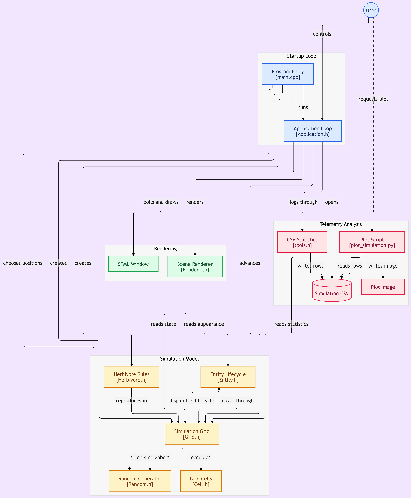

## Générer un graphique avec python :
*Pré-requis: pip et matplotlib (installé avec pip)*  
  
```shell
python plot_simulation.py simulation_data.csv data_plot.png
```
  
## Template `run.sh` pour build et lancer le projet:
```shell
cmake -B build
cmake --build build

# Path to RTS executable (change if needed)
build/bin/main # add --csv to generate CSV instead of display
```


# Architecture du projet
[]